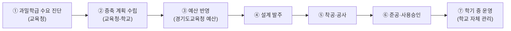

## 시도한 것

- `공약검토-대장동·백현동·운중동·판교동` 4건의 "다음 단계 제안"에서 추가 확인 항목 30개를 추출
- 지역별(4개) + 공통 사실축별(교통·교육·복지·안전·개발, 5개) + 예산·의회·교통단계 검증틀(3개) 총 12개 이상의 subagent를 병렬 투입
- 미확인 항목에 대해 재조사(3개 추가 subagent) 후 최종 매트릭스와 source log에 결과 반영
- 최종 통합 보고서 `2026-05-05 공약검토 사실정보 확인.md` 1건으로 종합

## 성공한 것

- fact ID 30개 중 입증됨 14, 부분 입증 6, 미확인 10으로 분류 완료
- 공식 원문 URL 60건 이상을 source-log에 연결
- 미확인 항목에 재조사를 붙여 S-06(배리어프리)을 `미확인 → 부분 입증`으로 상향
- 지역별 브리프, 축별 병합본, 보강 브리프, 최종 매트릭스의 계층 구조를 갖춘 것

## 막힌 것 / 다음에 해결

- T-06(서판교역 환승센터), T-07(판교동역 신설 BC값), F-04(판교동 578번지 복합시설 원문), E-03(판교초 특수학급), D-03/D-04(주차·테마거리)는 공식 원문이 끝내 확인되지 않음
- `bundang-promises/` 하위에 중간 파일 20개 생성 → 검토자가 어느 파일을 읽어야 하는지 불분명
- 행정 프로세스(타당성→예타→기본계획→착공→준공→운영)의 각 단계 의미와 현재 위치가 텍스트 표로만 표현되어 맥락 파악이 어려움

---

## 새로 알게 된 사이트·포맷·정책

- 성남시청 `photoGallView` 경로에 착수보고회·중간보고회 사진기록이 공시됨 (백현마이스역)
- `goesn.kr`(성남교육지원청)이 학교별 하위 도메인을 운영하며, 학교 공지가 학교 도메인에만 있고 교육청 본청엔 없는 경우가 많음
- 월곶~판교선, 8호선 판교연장은 단계가 달라 같은 "철도사업 현황" 페이지에 묶이면 혼동 유발

---

## 개선 제안

### 1. 중간 파일 수 최소화 — 파일 역할 구분

**현재 구조 문제**

20개 중간 파일이 생긴 이유는 subagent가 각자 결과를 별도 파일로 떨어뜨렸기 때문이다. 지역별 브리프 4개와 축별 병합본 5개, 재조사 보강본 3개, 원본 매트릭스와 최종 매트릭스가 따로 존재했다.

**권장 구조 (3-tier)**

```
archive/processed/<slug>/
├── README.md               ← 검토자 진입점: 요약 + 판정 집계 + 미확인 목록 + 파일 안내
├── fact-report.md          ← 검토자용 최종 1문서: 분야별 확인사실·유보사항 + 행정단계 다이어그램
└── _internal/              ← 에이전트 작업 파일, 검토자는 접근 불필요
    ├── source-log.md
    ├── subagent-briefs.md
    ├── axis-merged/        ← 축별 병합본
    └── followup/           ← 재조사 보강본
```

- **검토자는 `fact-report.md` 1개만 읽는다.**
- `_internal/`은 재현성과 출처 추적을 위해 보존하되 README에서 직접 링크하지 않는다.
- subagent는 결과를 직접 `_internal/` 하위에만 저장하고, 에이전트가 `fact-report.md`에 최종 반영한다.

---

### 2. 참고할 보고서 양식

다음 세 가지 형식이 이 사례에 맞다.

**A. OECD 정책 브리프 (Policy Brief) 형식**
- 1~2쪽, 판정 요약 표 → 분야별 분석 → 근거 각주 순서
- 검토자가 전체를 읽지 않고 표만 봐도 상태 파악 가능
- 이번 `2026-05-05 공약검토 사실정보 확인.md`가 이 형식에 가장 근접함

**B. 의회 예산정책처(NABO) 사업 검토 보고서 형식**
- 사업별 표지(사업명·주관·예산·단계) → 핵심 쟁점 → 판단 → 보완 필요사항
- 사업 하나씩 독립 섹션으로 나뉘어 항목별 깊이가 균일함
- `fact-report.md`의 섹션 구조를 이 형식으로 정형화하면 좋음

**C. Mermaid 기반 상태도 삽입 형식 (GitHub Flavored Markdown)**
- 행정 프로세스를 Mermaid `flowchart LR` 또는 `stateDiagram-v2`로 직접 문서 안에 삽입
- GitHub, VS Code, Obsidian 등에서 바로 렌더링됨
- 예: `[ 기획 ] → [ 예비타당성 ] → [ 기본계획 ] → [ 실시설계 ] → [ 착공 ] → [ 준공 ] → [ 운영 ]`에서 현재 위치를 강조

---

### 3. 미확인 최소화 반복 프로세스

```
[추출] 검토 문서에서 확인 항목 추출 → fact-ID 부여
   ↓
[1차 조사] 분야 축 기준 병렬 subagent → fact-report 초안 작성
   ↓
[갭 식별] 미확인 항목 목록 생성 → 주관기관·문서 유형별 재분류
   ↓
[2차 조사] 미확인 항목만 재투입 (공식 창구별: 성남시·교육청·국토부·경기도)
   ↓
[갱신] fact-report 해당 행만 패치 + source-log 추가
   ↓
[종료 판정] (a) 미확인이 더 줄지 않거나 (b) 2회 재조사 후에도 공식 원문 없음
            → 해당 항목에 "공식 정보 부재" 표시 후 확인 종료
```

**핵심 규칙**
- 재조사는 사실축이 아니라 **주관기관·문서 유형** 기준으로 묶어 투입한다.  
  (예: `성남시 고시·공고 전용`, `경기도교육청 공시`, `국토부 예타 결과`)
- 2회 재조사 후에도 미확인이면 `"공식 원문 없음 — 현 시점 검증 불가"`로 확정하고 다음 회차로 이월하지 않는다.

---

### 4. 행정 프로세스 시각화 방안

#### 4-A. 철도·환승 사업 단계 표준 다이어그램

```mermaid
flowchart LR
    A["① 정책 선언\n(시장 신년사·공약)"] --> B["② 사전구상\n(타당성 연구 용역)"]
    B --> C["③ 사전타당성조사\n(성남시 자체)"]
    C --> D["④ 예비타당성조사\n(KDI/한국개발연구원)"]
    D --> E["⑤ 기본계획 수립\n(국토부 고시)"]
    E --> F["⑥ 기본설계·실시설계"]
    F --> G["⑦ 착공"]
    G --> H["⑧ 준공·개통"]
    H --> I["⑨ 운영·유지관리\n(운영기관 지정)"]

    style A fill:#e8f5e9
    style B fill:#e8f5e9
    style C fill:#fff9c4
    style D fill:#fff9c4
    style E fill:#fce4ec
    style F fill:#fce4ec
    style G fill:#fce4ec
    style H fill:#e3f2fd
    style I fill:#e3f2fd
```



각 fact 항목에 `현재 단계: ③ 사전타당성` 같이 숫자 레이블을 붙이면 표와 다이어그램이 연결된다.

#### 4-B. 학교 시설 증축 단계



#### 4-C. fact-report 내 용어 해설 블록

각 사업 섹션 아래 접을 수 있는 **용어 해설** 블록을 삽입한다.

```markdown
> **용어 해설**  
> - **예비타당성조사(예타)**: 총사업비 500억 원 이상 대규모 공공사업에 대해 기획재정부 산하 기관이 비용편익(BC) 분석 등을 통해 사업 타당성을 객관적으로 검토하는 제도. BC 값이 1.0 이상이어야 사업 추진이 권고된다.  
> - **사전타당성조사**: 예타 신청 전 지자체 자체적으로 사업의 기초 타당성을 검토하는 단계. 법적 의무는 없으나 예타 신청 근거 자료로 사용된다.  
> - **주관기관(시행자)**: 사업 예산·계약·감리를 직접 책임지는 기관. 철도는 국토교통부·국가철도공단, 지자체 건물은 성남시·한국토지주택공사(LH)가 맡는 경우가 많다.
```

#### 4-D. 사업별 예산 구조 표 표준

| 항목 | 내용 |
| --- | --- |
| 총사업비 | XXX억 원 |
| 국비 / 도비 / 시비 비율 | X% / X% / X% |
| 예산 근거 문서 | 중기재정계획 / 도시관리계획 고시 / 의회 의결 |
| 확인 연도 | XXXX년 XX호 |
| 미확인 필드 | 연도별 집행액, 사업 변경 이력 |

---

## 자동화 후보

- **skill**: `promise-factcheck` — 공약검토 문서 1건 입력 → fact-ID 추출 → subagent 투입 → fact-report 초안 1건 반환. 현재 수동 12단계를 3단계로 줄임
- **skill**: `admin-process-diagram` — 사업 유형(철도/학교/복지관/도로) 입력 → 해당 행정단계 Mermaid 다이어그램 반환
- **agent**: `fact-iteration-agent` — 미확인 항목 목록 + 주관기관 목록 입력 → 주관기관별 분류 재조사 → 2회 후 확정 종료
- **hook**: 세션 종료 전 `_internal/` 폴더 파일 수가 10개 초과하면 자동으로 fact-report 병합 실행

---

## 출처·PII 점검 결과

- 공식 URL 60건 이상 수집, 전체 source-log에 기록됨
- PII 해당 내용 없음
- `archive/raw/` 원본 보존은 이번 세션에서 미실행 — 다음 회차에서 `archive_fetch` 도구로 원본 URL 보존 적용 필요
